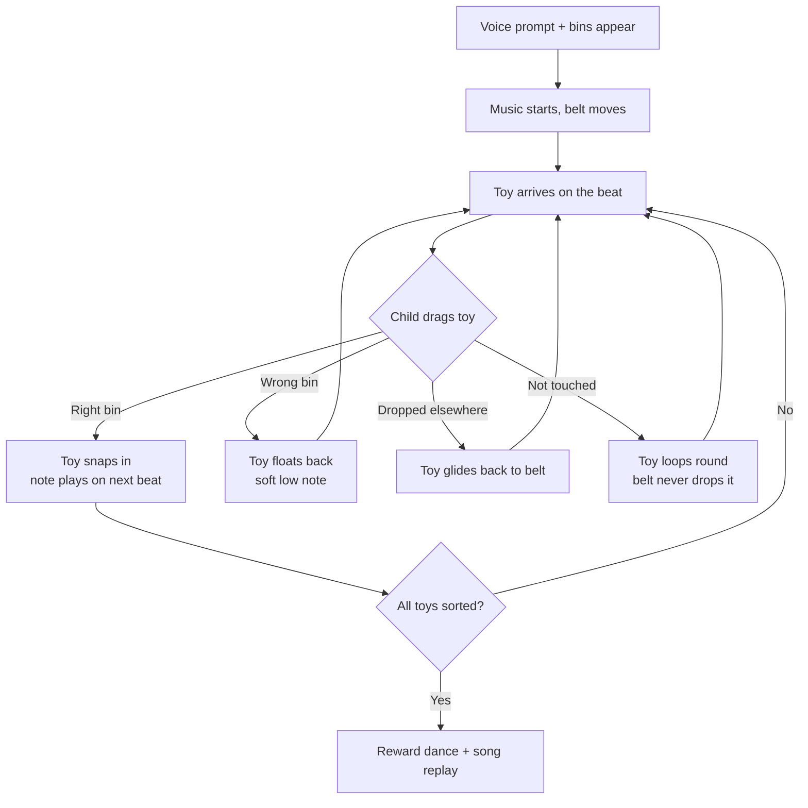
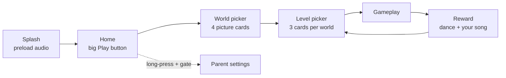
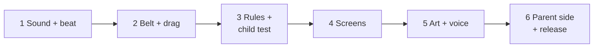

# Rhythm Workshop — Design Document

Sep 24, 2026 · @Dr. Humayun Shahzad

## Summary and decisions to lock

Rhythm Workshop is a strong, buildable concept, but version 1 should be simpler: fully offline with no Firebase, and a rhythm system where a child can never "miss the beat". Nothing below is decided until Homi confirms it; each row starts as Proposed.

| # | Decision | Proposed choice | Why | Status |
| --- | --- | --- | --- | --- |
| D1 | App name | **Rhythm Workshop** (drop "Tempo Sort" and "Rhythm & Sorting Workshop") | One name everywhere: store listing, splash, code package | Proposed |
| D2 | Backend in v1 | **None.** Levels ship as local JSON files inside the app | Removes Firebase, privacy risk, setup work and a network dependency | Proposed |
| D3 | Analytics in v1 | **None off-device.** Progress stays on the tablet only | Simplest path through COPPA and Play Families review | Proposed |
| D4 | Rhythm rule | **Auto-quantise:** a correct drop always succeeds; the chime waits for the next beat | Ages 3–4 cannot hit a 120 ms window; the old rule punished off-beat drops | Proposed |
| D5 | Wrong bin | Item floats back to the belt with a soft note; belt never stops | Non-punitive, keeps the music going | Proposed |
| D6 | Colour sorting | Every colour bin also carries a **shape symbol** (e.g. red = circle, blue = square) | About 1 in 12 boys has colour-vision deficiency | Proposed |
| D7 | Audio library | **flutter\_soloud** only (drop flame\_audio for sound effects) | Lower latency, one audio system to learn | Proposed |
| D8 | State management | Plain Flame components + one small `ChangeNotifier`; no Bloc/Riverpod in v1 | Fewer libraries for a learner; enough for 3 screens | Proposed |
| D9 | Session length | Sessions end after \~6 minutes with a calm "goodbye" song; parent can change it | Healthy screen-time for 3–6 year olds | Proposed |
| D10 | Parental gate | Keep, but only guards Settings (no ads, links or purchases in v1) | Smaller surface, easier review | Proposed |
| D11 | Languages | English + Urdu voice, chosen once in Settings | Matches target families; zero on-screen text for kids | Proposed |

## Review verdict

The learning idea, non-punitive tone, bilingual voice and accessibility goals are good. Twelve issues need fixing before code, four of them serious.

**What works well**

- Pairing sorting (early maths) with rhythm (auditory timing) is a real differentiator.
- "No Game Over" and soft correction sounds suit 3–6 year olds.
- Zero-text play, 64 dp targets and immersive mode are the right defaults.
- A single musical key (C major) so every sound harmonises is a smart audio decision.

**Issues found**

| # | Severity | Issue in the shared design | Fix in this document |
| --- | --- | --- | --- |
| 1 | Serious | Rule contradiction: "off-beat drop nudges the item back" punishes timing, yet the app promises no punishment | Auto-quantise (D4): correct bin always wins; timing only adds a bonus sparkle |
| 2 | Serious | ±120 ms window while dragging a moving object is too hard for age 3–4 | Timing is a bonus, never a gate; window widened to ±200 ms for bonus |
| 3 | Serious | Firebase + `device_id_hash` + session timestamps conflicts with "offline, zero data" and adds Families-policy risk | No backend in v1 (D2, D3); levels in local JSON |
| 4 | Serious | Parental gate code will not compile: `CrossAlignment.stretch` should be `CrossAxisAlignment.stretch`; multi-touch is displayed but never required | Corrected gate in the Parental gate section |
| 5 | Medium | Red vs blue bins alone exclude colour-blind children | Shape symbol on every bin (D6) |
| 6 | Medium | Palette colours fail contrast: amber `#F5A623` and mint `#7ED321` on white are about 2:1, below 4.5:1 | Darker accessible palette in UI section |
| 7 | Medium | Beat clock not tied to the music; a separate timer drifts from the audio over minutes | Beat derived from the music's play position |
| 8 | Medium | Metronome taps on every beat play on top of a track that already has rhythm — noisy | Taps only in "practice" levels; Milo shows the beat visually |
| 9 | Minor | Audio code preloads `perfect_01/02` but plays `perfect_03`; no C6 file despite the comment; `bgm_workshop_02` missing from folder tree | Complete manifest and file tree |
| 10 | Minor | Urdu mixes formal سرخ with spoken لال | Use لال / نیلا consistently |
| 11 | Minor | Two state libraries offered (Bloc or Riverpod) | Neither in v1 (D8) |
| 12 | Minor | "Reward & Calibration screen" mixes a kid screen with an adult task | Reward screen for kids; audio calibration moves to Settings |

**Scope note:** the 8-week plan assumes art, animation and voice recording are ready. For a family project these are the slowest parts; see Build stages.

## Concept and core gameplay loop

Children sort toys from a moving conveyor belt into bins; every correct sort adds a musical note that lands on the beat, so sorting builds a song.

- **World:** a warm wooden toy workshop run by animal musicians.
- **Target age:** 3–6, in two bands (3–4 and 5–6).
- **Platform:** Android tablets and phones, landscape only, fully offline.

**Revised loop (one level = about 60–90 seconds, 10–12 items)**



The three changes from the original loop:

1. **The child never has to be on time.** A correct drop always counts. The app holds the chime until the next beat, so it always sounds musical (auto-quantise).
2. **Timing is a bonus.** A drop within ±200 ms of a beat adds gold sparkles and a brighter chime. Older children discover it; younger ones are never blocked by it.
3. **Toys are never lost.** A toy that reaches the end of the belt loops back round, so there is no "miss".

**The song reward:** each correct sort records its note. On the reward screen the child's notes replay as a short melody — "the song you made". This turns sorting into music without adding difficulty.

## Learning objectives and level ladder

The app teaches one skill at a time: sort by a single attribute first, then by category, then by pattern. v1 ships 12 levels across 4 worlds.

**Objectives**

- **Classification:** group by colour, size, shape, then category (fruit/vegetable, animal/vehicle).
- **Pattern recognition:** notice and continue a simple AB pattern (5–6 band only).
- **Rhythm:** feel a steady beat through Milo's drumming and on-beat chimes.
- **Fine motor:** controlled single-finger drag and release.

**Level ladder**

| World | Levels | Sort by | Bins | Tempo | Age band | New idea introduced |
| --- | --- | --- | --- | --- | --- | --- |
| 1 Colour Corner | 1–3 | Colour (red/blue, then + yellow) | 2 → 3 | 70 BPM | 3–4 | Dragging, bins, beat |
| 2 Big & Small | 4–6 | Size (big/small) | 2 | 70–80 BPM | 3–4 | Same object, different size |
| 3 Shape Shop | 7–9 | Shape (circle/square/triangle) | 2 → 3 | 80 BPM | 4–5 | Shapes regardless of colour |
| 4 Fruit Market | 10–12 | Category (fruit/vegetable, then AB pattern) | 2 | 80–90 BPM | 5–6 | Sorting by meaning, patterns |

**Rules for the ladder**

- All levels are unlocked from the start; a star marks finished ones. No locks means no frustration and no parent help needed.
- Only one attribute changes at a time. In World 3, shapes come in mixed colours so the child learns to ignore colour.
- Belt speed rises slightly within a level only if the child sorts 5 in a row correctly; it drops back after two wrong drops. This is gentle, invisible difficulty adjustment.

## UI layout, colours and touch targets

Landscape only, one screen of play, no text for the child, and every touch target at least 64 × 64 dp (toys are 96 dp).

**Gameplay layout**

```
+---------------------------------------------------------------+
| [||] Pause (64dp, top-left)      Milo drumming      ★ 3 stars |
|                                                               |
|  ===>  ===>   CONVEYOR BELT  (toys ride left to right) ===>  |
|                                                               |
|   +----------------+     Pip       +----------------+         |
|   |  BIN 1  ● red  |   (helper)    |  BIN 2  ■ blue |         |
|   |  200 x 160 dp  |               |  200 x 160 dp  |         |
|   +----------------+               +----------------+         |
+---------------------------------------------------------------+
```

- **Belt** sits in the top third so the child's hand does not cover the bins while dragging downward.
- **Bins** are wide (about 200 × 160 dp) with 48 dp gaps; for 3 bins the layout spreads across the full width.
- **Pause** is the only control; it needs a 1-second press-and-hold (a ring fills) so taps by accident do nothing.
- **Stars** show progress; no numbers or scores.

**Accessible palette** (checked against WCAG; the original amber and mint were about 2:1 and are kept for backgrounds only)

| Role | Colour | Contrast on cream `#FFF4E0` | Use |
| --- | --- | --- | --- |
| Background | Cream `#FFF4E0` | — | Workshop wall |
| Text / outlines | Walnut `#4A3728` | 10.3:1 | All outlines, icons |
| Red bin | `#C62828` + ● circle | 5.2:1 | Colour levels |
| Blue bin | `#1E5AA8` + ■ square | 6.3:1 | Colour levels |
| Green bin | `#2E7D32` + ▲ triangle | 4.7:1 | Colour levels |
| Yellow bin | `#FFC107` fill + 4 dp walnut outline + ★ star | outline 10.3:1 | Yellow alone is too light, so the outline carries contrast |
| Warm accent | Amber `#F5A623` | 1.9:1 | Decoration only, never meaning |

**Rules**

- Meaning is never carried by colour alone: every colour has a matching symbol on the bin and on the toy.
- No flashing faster than 3 times per second; no screen shake.
- A "calm mode" setting (parent) softens colours and slows the belt for children with sensory sensitivity.

## Characters, world and screen flow

Two characters, four kid screens and one adult screen — enough for v1.

**Characters**

| Character | Role | Animations needed (v1) | Voice |
| --- | --- | --- | --- |
| Milo the Monkey | Drummer; shows the beat with head bob and bongo tap | Idle, drum-on-beat, celebrate | None (drum sounds only) |
| Pip the Penguin | Helper between bins; reacts to sorts | Idle, happy clap, gentle "hmm" (wrong bin), dance | English + Urdu praise lines |

Pip never looks sad or disappointed. On a wrong bin he tilts his head and points at the right bin once.

**Screen flow**



| Screen | What the child sees | Notes |
| --- | --- | --- |
| Splash | Workshop doors opening (2–3 s) | Loads all sounds; no tap needed |
| Home | One huge Play button with Pip waving | Welcome voice line plays once per session |
| World picker | 4 picture cards (apple, big/small blocks, shapes, fruit basket) | Cards 160 dp tall |
| Level picker | 3 cards; star on finished ones | Back arrow 64 dp, top-left |
| Gameplay | Belt, bins, Milo, Pip | See UI section |
| Reward | Characters dance; child's notes replay; big "again" and "next" pictures | Tapping musical buttons is optional fun, max 20 s |
| Parent settings | Language, volume, session length, calm mode, reset progress, privacy policy | Behind parental gate; plain text allowed here |

**Session end:** after the session length (default 6 min), the current level finishes, then a "goodnight workshop" scene plays and returns to Home. It does not cut a level mid-way.

## Interaction and rhythm timing system

Simple rectangle maths decides where a toy landed, and the beat is read from the music itself so sound and visuals never drift apart. No machine learning is needed.

**Touch rules**

- **One finger only.** The first finger to touch a toy owns it; any second touch (palm, other hand) is ignored until it lifts.
- **Grab is generous.** A toy's touch area is 24 dp bigger than its picture on every side.
- **Magnetic bins.** Each bin's drop zone is 40 dp bigger than its drawing. If a toy overlaps two zones, the bigger overlap wins.
- **Missed drop.** Released anywhere else, the toy glides back to the belt in 300 ms. No sound of failure.
- **Haptics.** Built-in Flutter `HapticFeedback.lightImpact()` on a correct drop, nothing on a wrong one. No extra package or permission needed; switchable off in Settings.

**Timing rules (auto-quantise)**

| Drop | What happens | Sound | Visual |
| --- | --- | --- | --- |
| Right bin, within ±200 ms of a beat | Counts; bonus | Bright chime immediately | Gold sparkles |
| Right bin, between beats | Counts | Chime waits for the next beat (max one beat, 0.75 s at 80 BPM) | Normal glow |
| Wrong bin | Toy floats back | Soft low note F3 | Pip points to right bin |

The beat time comes from the music's current play position, not a separate timer. A separate timer drifts by tens of milliseconds over a few minutes on cheap phones.

```latex
\text{beat length (ms)} = \frac{60000}{\text{BPM}} \qquad \text{offset} = t_{\text{music}} \bmod \text{beat length}
```

**Beat clock (Dart)**

```dart
import 'package:flutter_soloud/flutter_soloud.dart';

/// Reads the beat from the music's play position, so it never drifts.
class BeatClock {
  BeatClock({required this.bpm});
  final double bpm;

  double get beatMs => 60000 / bpm;

  /// Current music time in milliseconds, straight from the audio engine.
  double musicMs(SoundHandle music) =>
      SoLoud.instance.getPosition(music).inMicroseconds / 1000.0;

  /// Distance to the nearest beat. Negative = a little early.
  double offsetFromNearestBeat(double ms) {
    final phase = ms % beatMs;
    return phase <= beatMs / 2 ? phase : phase - beatMs;
  }

  /// Time left until the next beat.
  double msUntilNextBeat(double ms) => beatMs - (ms % beatMs);
}
```

**Finding the bin (Dart)**

```dart
import 'dart:ui';

/// Returns the bin the toy was dropped into, or null for "nowhere".
Bin? findTargetBin(Rect toyRect, List<Bin> bins) {
  const snapMargin = 40.0; // magnetic zone, in logical pixels (dp)
  Bin? best;
  double bestArea = 0;
  for (final bin in bins) {
    final zone = bin.rect.inflate(snapMargin);
    final overlap = zone.intersect(toyRect);
    if (overlap.width <= 0 || overlap.height <= 0) continue;
    final area = overlap.width * overlap.height;
    if (area > bestArea) {
      bestArea = area;
      best = bin;
    }
  }
  return best;
}
```

**Handling a drop (Dart)**

```dart
void onToyReleased(Toy toy) {
  final bin = findTargetBin(toy.rect, bins);

  if (bin == null) {           // dropped on empty space
    toy.glideBackToBelt();
    return;
  }
  if (bin.attribute != toy.attribute) {  // wrong bin: gentle, no penalty
    audio.playSoftNote();
    pip.pointAt(correctBinFor(toy));
    toy.floatBackToBelt();
    streak = 0;
    return;
  }

  // Right bin: always succeeds.
  final now = clock.musicMs(musicHandle);
  final onBeat = clock.offsetFromNearestBeat(now).abs() <= 200;
  final waitMs = onBeat ? 0.0 : clock.msUntilNextBeat(now);

  toy.snapInto(bin);
  HapticFeedback.lightImpact();
  streak++;
  audio.playChime(streak: streak, bright: onBeat,
      delay: Duration(milliseconds: waitMs.round()));
  songNotes.add(toy.noteIndex); // replayed on the reward screen
}
```

These snippets show the logic; class names like `Toy`, `Bin` and `pip` are placeholders to be defined in Stage 2.

## Audio design and asset manifest

The sound principles you wrote are kept (soft attacks, loudness targets, no harsh buzzers); four corrections make the music actually fit together.

**Corrections**

1. **Every track in C major.** `bgm_workshop_02` was in G major; C-major chimes would clash with it. v1 uses C major for all music.
2. **Chimes use the pentatonic scale** (C, D, E, G, A). Any of these notes sound pleasant together, so the child's replayed "song" always sounds good.
3. **Loop lengths must be whole bars.** 1:20 at 80 BPM is 106.7 beats, so the loop would slip off the beat each time it repeats. Corrected lengths are below.
4. **Pitch randomising (±50 cents) only on the pick-up pop**, never on musical notes, or they go out of tune.

**Loudness targets (kept):** music −20 LUFS, voice −14 LUFS, effects −16 LUFS. Soft attack of 5–10 ms on every effect.

**Music**

| File | Style | BPM | Loop length | Beats (bars of 4) |
| --- | --- | --- | --- | --- |
| `bgm/bgm_calm.ogg` | Kalimba, brushed snare | 70 | 1:36 | 112 (28) |
| `bgm/bgm_workshop_01.ogg` | Woodblock, marimba, ukulele | 80 | 1:24 | 112 (28) |
| `bgm/bgm_workshop_02.ogg` | Xylophone, soft bass | 90 | 1:20 | 120 (30) |
| `bgm/bgm_goodnight.ogg` | Slow music box, session end | 60 | 0:32 (plays once) | 32 (8) |

**Sound effects**

| File | When | Sound |
| --- | --- | --- |
| `sfx/sfx_pick_up.wav` | Toy grabbed | Soft wooden pop, pitch varies ±50 cents |
| `sfx/sfx_note_c5.wav` … `sfx_note_c6.wav` (6 files: C5 D5 E5 G5 A5 C6) | Correct drop | Xylophone note; streak climbs the scale |
| `sfx/sfx_sparkle.wav` | On-beat bonus | Light shimmer layered over the note |
| `sfx/sfx_soft_note.wav` | Wrong bin | Warm marimba F3, quiet |
| `sfx/sfx_whoosh.wav` | Toy glides back | Very soft air sound |
| `perc/perc_tap_down.wav`, `perc/perc_tap_up.wav` | Practice levels only (1, 4, 7) | Milo's bongo, beat 1 / beats 2–4 |
| `perc/perc_fill.wav` | Level complete | 4-note drum roll |

The belt rustle loop from the original is dropped: a constant noise adds fatigue and nothing to learning.

**Voice lines** (same file names under `vo/en/` and `vo/ur/`)

| File | English | Urdu |
| --- | --- | --- |
| `vo_welcome` | Welcome to the workshop! Let's sort to the music! | ورکشاپ میں خوش آمدید! آئیے موسیقی کے ساتھ چیزیں الگ کریں! |
| `vo_prompt_colour` | Red toys in the red box! | لال کھلونے لال ڈبے میں! |
| `vo_prompt_size` | Big ones here, small ones there! | بڑے یہاں، چھوٹے وہاں! |
| `vo_prompt_shape` | Circles here, squares there! | گول یہاں، چوکور وہاں! |
| `vo_prompt_food` | Fruits here, vegetables there! | پھل یہاں، سبزیاں وہاں! |
| `vo_try_here` | Try this one! | یہاں ڈالیں! |
| `vo_praise_01` | Great rhythm! | شاباش! بہت خوب! |
| `vo_praise_02` | Super sorting! | زبردست! |
| `vo_goodnight` | The workshop is sleeping now. See you soon! | ورکشاپ اب سو رہی ہے۔ پھر ملیں گے! |

The prompt now names a bin with a symbol too, and Pip points at it, so the child does not need to understand the words.

**Audio engine (Dart, flutter\_soloud)**

```dart
import 'package:flutter_soloud/flutter_soloud.dart';

class AudioEngine {
  final _s = SoLoud.instance;
  final Map<String, AudioSource> _sounds = {};
  SoundHandle? music;
  bool muted = false;

  static const _notes = ['c5', 'd5', 'e5', 'g5', 'a5', 'c6'];

  /// Call once on the splash screen.
  Future<void> init() async {
    await _s.init(); // check buffer-size option in the installed version
    final files = [
      'sfx/sfx_pick_up.wav', 'sfx/sfx_sparkle.wav',
      'sfx/sfx_soft_note.wav', 'sfx/sfx_whoosh.wav',
      for (final n in _notes) 'sfx/sfx_note_$n.wav',
    ];
    for (final f in files) {
      _sounds[f] = await _s.loadAsset('assets/audio/$f');
    }
  }

  Future<void> startMusic(String file) async {
    final src = await _s.loadAsset('assets/audio/bgm/$file');
    music = await _s.play(src, looping: true, volume: 0.6);
  }

  /// Streak 1 = C5, 2 = D5 ... then repeats. Waits for the beat if needed.
  void playChime({required int streak, required bool bright,
                  Duration delay = Duration.zero}) {
    if (muted) return;
    final note = _notes[(streak - 1) % _notes.length];
    Future.delayed(delay, () {
      _s.play(_sounds['sfx/sfx_note_$note.wav']!, volume: 0.85);
      if (bright) _s.play(_sounds['sfx/sfx_sparkle.wav']!, volume: 0.5);
    });
  }

  void playSoftNote() {
    if (muted) return;
    _s.play(_sounds['sfx/sfx_soft_note.wav']!, volume: 0.5);
  }
}
```

**Folder tree**

```
assets/audio/
├── bgm/   bgm_calm.ogg  bgm_workshop_01.ogg  bgm_workshop_02.ogg  bgm_goodnight.ogg
├── sfx/   sfx_pick_up.wav  sfx_sparkle.wav  sfx_soft_note.wav  sfx_whoosh.wav
│        sfx_note_c5.wav  sfx_note_d5.wav  sfx_note_e5.wav
│        sfx_note_g5.wav  sfx_note_a5.wav  sfx_note_c6.wav
├── perc/  perc_tap_down.wav  perc_tap_up.wav  perc_fill.wav
└── vo/
    ├── en/  vo_welcome.ogg  vo_prompt_*.ogg (4)  vo_try_here.ogg  vo_praise_01/02.ogg  vo_goodnight.ogg
    └── ur/  (same 9 file names)
```

## Architecture and tech stack

Four packages and no server: Flutter for screens, Flame for the belt and toys, flutter\_soloud for sound, shared\_preferences for stars and settings.

| Need | Choice | Replaces in original | Reason |
| --- | --- | --- | --- |
| Framework | Flutter 3.x (stable) | — | Already used in Homi's other apps |
| Game loop, sprites, drag | `flame` | — | Built-in drag callbacks and animation |
| Audio | `flutter_soloud` | `flame_audio` | Low latency, reads play position for the beat clock |
| Saved progress, settings | `shared_preferences` | Firestore | On-device only, tiny data |
| Haptics | Flutter `HapticFeedback` (built in) | `vibration` package | No extra permission |
| State | One `ChangeNotifier` (`GameSettings`) | Bloc / Riverpod | Fewer concepts to learn |
| Levels | JSON files in `assets/levels/` | Firestore `game_levels` | Works offline on first launch |

**Project layout**

```
lib/
├── main.dart               // landscape lock, immersive mode, app start
├── settings/game_settings.dart   // language, volume, session length, calm mode
├── audio/audio_engine.dart
├── audio/beat_clock.dart
├── levels/level.dart       // reads assets/levels/*.json
├── game/workshop_game.dart // Flame game: belt, toys, bins
├── game/toy.dart  game/bin.dart  game/belt.dart
├── game/characters/milo.dart  game/characters/pip.dart
├── screens/  home  world_picker  level_picker  reward  parent_settings
└── widgets/parental_gate.dart
assets/  audio/  images/  levels/
```

**App start (Dart)**

```dart
import 'package:flutter/material.dart';
import 'package:flutter/services.dart';

Future<void> main() async {
  WidgetsFlutterBinding.ensureInitialized();
  await SystemChrome.setPreferredOrientations([
    DeviceOrientation.landscapeLeft,
    DeviceOrientation.landscapeRight,
  ]);
  await SystemChrome.setEnabledSystemUIMode(SystemUiMode.immersiveSticky);
  runApp(const RhythmWorkshopApp());
}
```

Also set `android:screenOrientation="sensorLandscape"` in `AndroidManifest.xml` so the app never flashes portrait on launch.

**Level file (local JSON, one per level)**

```json
{
  "id": "colour_01",
  "world": 1,
  "sortBy": "colour",
  "music": "bgm_calm.ogg",
  "bpm": 70,
  "beltSpeed": 90,
  "practiceTaps": true,
  "voicePrompt": "vo_prompt_colour",
  "bins": [
    { "id": "red",  "symbol": "circle", "image": "bins/bin_red.png" },
    { "id": "blue", "symbol": "square", "image": "bins/bin_blue.png" }
  ],
  "items": [
    { "id": "car_red",    "bin": "red",  "image": "items/car_red.png" },
    { "id": "block_blue", "bin": "blue", "image": "items/block_blue.png" }
  ],
  "itemCount": 10
}
```

Changes from the Firestore schema: text labels removed (children see symbols, voice explains), `sound_pitch_index` removed (the streak picks the note), `practiceTaps` added.

**Immersive mode limit:** Android does not let an app block the Home or Recents gesture. The parent settings screen should explain Android's built-in *screen pinning*, which does lock the child into the app.

## Data, privacy and offline design

v1 collects nothing and sends nothing: the release build has no internet permission at all, which is the simplest possible privacy promise to parents and to Google Play.

**Why Firebase is removed from v1**

- The original schema stores a hashed device ID plus timestamps. A persistent identifier for a child under 13 is exactly what COPPA and the Play Families policy restrict, and it needs careful disclosure and SDK configuration.
- Firestore's offline cache only works *after* a first online download. A child opening the app for the first time without Wi-Fi would see no levels.
- Remote level editing is not needed yet: 12 levels ship inside the app and update with each app release.
- It removes a Firebase project, security rules and a data-deletion process from Homi's workload.

**What is stored, on the device only**

| Item | Example | Where |
| --- | --- | --- |
| Stars per level | `colour_01: 3` | shared\_preferences |
| Language | `ur` | shared\_preferences |
| Volume, haptics on/off, calm mode | `0.7, true, false` | shared\_preferences |
| Session length | `6` minutes | shared\_preferences |

Parents can wipe it with "Reset progress" in Settings; uninstalling also removes it.

**Privacy proof checks**

- `AndroidManifest.xml` (main) has no `INTERNET` permission. Flutter only adds it to the debug build.
- No analytics, crash-reporting or ad SDKs in `pubspec.yaml`.
- A one-page privacy policy says: "This app collects no personal information and does not connect to the internet." It is linked from the Play listing and shown in parent Settings as plain text (no web link, so no gate needed).

**If analytics are wanted later (v2):** send only anonymous totals (levels played, average accuracy), no device ID, with a parent opt-in. Decide this as its own decision, not as part of v1.

## Parental gate (corrected code)

The gate keeps your multiplication idea but uses its own number pad instead of the phone keyboard, checks automatically, and closes after 3 wrong tries.

**What changed from the shared version**

| Problem in original | Fix |
| --- | --- |
| `CrossAlignment.stretch` does not exist; code will not compile | `CrossAxisAlignment.stretch` |
| Multi-touch was counted and shown but never required | Removed; the maths problem is enough for Play policy and simpler |
| System keyboard pops up; it has emoji, voice and settings buttons a child could tap | On-screen number pad with 64 dp keys |
| Addition option (15–54 + 15–54) needs a 3-digit answer sometimes and a Submit button | Multiplication only: 6–9 × 5–9 always gives a 2-digit answer (30–81), so it checks itself after two taps |
| Unlimited retries let a child keep guessing | Closes after 3 wrong answers |
| `onSuccess` callback | Returns `true`/`false`, easier to use with `await` |

**`widgets/parental_gate.dart`**

```dart
import 'dart:math';
import 'package:flutter/material.dart';

const _walnut = Color(0xFF4A3728);

/// Adult check before Settings. Returns true only if solved.
class ParentalGate extends StatefulWidget {
  const ParentalGate({super.key});

  static Future<bool> show(BuildContext context) async {
    final ok = await showDialog<bool>(
      context: context,
      barrierDismissible: false,
      builder: (_) => const ParentalGate(),
    );
    return ok ?? false;
  }

  @override
  State<ParentalGate> createState() => _ParentalGateState();
}

class _ParentalGateState extends State<ParentalGate> {
  final _random = Random();
  late int _a;
  late int _b;
  String _typed = '';
  int _wrongTries = 0;
  bool _showError = false;

  @override
  void initState() {
    super.initState();
    _newProblem();
  }

  void _newProblem() {
    _a = _random.nextInt(4) + 6; // 6 to 9
    _b = _random.nextInt(5) + 5; // 5 to 9  -> answer is always 30 to 81
    _typed = '';
  }

  void _tapDigit(int d) {
    if (_typed.length >= 2) return;
    setState(() {
      _typed += '$d';
      _showError = false;
    });
    if (_typed.length == 2) _check();
  }

  void _clear() => setState(() => _typed = '');

  void _check() {
    if (int.parse(_typed) == _a * _b) {
      Navigator.of(context).pop(true);
      return;
    }
    _wrongTries++;
    if (_wrongTries >= 3) {
      Navigator.of(context).pop(false);
      return;
    }
    setState(() {
      _showError = true;
      _newProblem();
    });
  }

  Widget _key(String label, VoidCallback onTap) => Padding(
        padding: const EdgeInsets.all(4),
        child: SizedBox(
          width: 64,
          height: 64,
          child: ElevatedButton(
            style: ElevatedButton.styleFrom(
              backgroundColor: const Color(0xFF1E5AA8),
              foregroundColor: Colors.white,
              padding: EdgeInsets.zero,
              shape: RoundedRectangleBorder(
                  borderRadius: BorderRadius.circular(12)),
            ),
            onPressed: onTap,
            child: Text(label,
                style: const TextStyle(
                    fontSize: 26, fontWeight: FontWeight.bold)),
          ),
        ),
      );

  Widget _keypad() => Column(
        mainAxisSize: MainAxisSize.min,
        children: [
          for (final row in const [[1, 2, 3], [4, 5, 6], [7, 8, 9]])
            Row(mainAxisSize: MainAxisSize.min, children: [
              for (final d in row) _key('$d', () => _tapDigit(d)),
            ]),
          Row(mainAxisSize: MainAxisSize.min, children: [
            _key('0', () => _tapDigit(0)),
            _key('⌫', _clear),
          ]),
        ],
      );

  @override
  Widget build(BuildContext context) {
    return Dialog(
      insetPadding: const EdgeInsets.all(12), // fits a 360 dp-tall phone
      backgroundColor: const Color(0xFFFFF4E0),
      shape: RoundedRectangleBorder(borderRadius: BorderRadius.circular(20)),
      child: Padding(
        padding: const EdgeInsets.all(12),
        child: Row(
          mainAxisSize: MainAxisSize.min,
          children: [
            SizedBox(
              width: 240,
              child: Column(
                mainAxisSize: MainAxisSize.min,
                crossAxisAlignment: CrossAxisAlignment.stretch,
                children: [
                  const Text('Grown-ups only',
                      style: TextStyle(
                          fontSize: 22,
                          fontWeight: FontWeight.bold,
                          color: _walnut)),
                  const SizedBox(height: 8),
                  const Text('Solve this to open Settings.',
                      style: TextStyle(fontSize: 16, color: _walnut)),
                  const SizedBox(height: 16),
                  Text('$_a × $_b = ${_typed.padRight(2, '_')}',
                      style: const TextStyle(
                          fontSize: 32,
                          fontWeight: FontWeight.w800,
                          color: _walnut)),
                  if (_showError)
                    const Padding(
                      padding: EdgeInsets.only(top: 8),
                      child: Text('Not quite — here is a new one.',
                          style: TextStyle(
                              fontSize: 15, color: Color(0xFFC62828))),
                    ),
                  const SizedBox(height: 16),
                  SizedBox(
                    height: 56,
                    child: OutlinedButton(
                      onPressed: () => Navigator.of(context).pop(false),
                      child: const Text('Close',
                          style: TextStyle(fontSize: 18)),
                    ),
                  ),
                ],
              ),
            ),
            const SizedBox(width: 16),
            _keypad(),
          ],
        ),
      ),
    );
  }
}
```

**Using it on the Home screen** — a faded gear in a corner that needs a long-press, so children rarely find it:

```dart
GestureDetector(
  onLongPress: () async {
    final ok = await ParentalGate.show(context);
    if (ok && context.mounted) {
      Navigator.of(context).push(MaterialPageRoute(
          builder: (_) => const ParentSettingsScreen()));
    }
  },
  child: const SizedBox(
    width: 64,
    height: 64,
    child: Icon(Icons.settings, color: Color(0xFFC8B8A0)),
  ),
)
```

## Compliance checklist

Because v1 has no network, ads, purchases or accounts, most of the original checklist is satisfied by design; these are the items still to tick before release. This is a practical checklist, not legal advice.

**Privacy (COPPA / GDPR-K)**

- [ ] Release `AndroidManifest.xml` has no `INTERNET` permission
- [ ] `pubspec.yaml` has no analytics, crash-report, ad or Firebase packages
- [ ] Privacy policy page published (a simple page on the HomiLabs website) stating no data is collected
- [ ] Same text visible in parent Settings

**Google Play Families**

- [ ] Target audience in Play Console: "5 and under" and "6–8"
- [ ] Data safety form: "No data collected, no data shared"
- [ ] Content rating questionnaire completed (expect "Everyone" / PEGI 3)
- [ ] Store listing, icon and screenshots show no misleading claims (e.g. do not claim "clinically proven")
- [ ] Parental gate guards Settings

**Child usability**

- [ ] Every tappable or draggable item at least 64 × 64 dp (check with Android Studio Layout Inspector)
- [ ] Colour is never the only cue: every colour bin has a symbol
- [ ] Text and outline contrast at least 4.5:1 (walnut on cream is 10.3:1)
- [ ] No flashing faster than 3 per second; no screen shake
- [ ] Only one finger can drag at a time; second touches ignored
- [ ] No failure sound or sad face anywhere
- [ ] All child-facing instructions work with sound off (Pip points, bins glow)
- [ ] Session ends gently at the parent-set length

**Quality**

- [ ] Steady 60 FPS on a low-cost test phone (e.g. a 2–3 year old Android Go or budget Samsung)
- [ ] Chime lands on the beat by ear after 10 minutes of play (no drift)
- [ ] Works in flight mode on first-ever launch
- [ ] Tested with 3–5 real children aged 3–6, with a parent present

## Build stages

Six small stages, each ending in a test on a real phone before the next begins; plan about 12 weeks part-time instead of 8, because art and voice recording take longest.

The key change: build the game with plain coloured shapes first and test it with a child in Stage 3. If it is not fun with shapes, art will not fix it.

| Stage | Build | Done when | Est. weeks |
| --- | --- | --- | --- |
| 1 Sound + beat | Landscape app, immersive mode, flutter\_soloud plays one loop, a circle pulses on every beat | Circle stays on the beat by ear after 10 minutes | 1–2 |
| 2 Belt + drag | Belt moves coloured squares; drag, snap into 2 bins, glide back when missed | A toy can be sorted and never lost; only one finger drags | 2 |
| 3 Rules + first child test | Right/wrong bin, auto-quantised chime, streak notes, level JSON loading, 3 placeholder levels | A 3–4 year old plays 3 levels without adult help | 1–2 |
| 4 Screens | Home, world and level pickers, reward screen with song replay, stars saved, session end | Full loop from Home to Reward and back works offline | 2 |
| 5 Art + voice | Milo, Pip, toys, bins, backgrounds; record English and Urdu lines; all 12 levels | All art and voice in; still 60 FPS on budget phone | 3 |
| 6 Parent side + release | Parental gate, Settings, privacy policy, checklist above, Play Console setup | Every checklist box ticked; internal test track live | 1–2 |



Start Stage 5's art and voice sourcing in parallel from week 1 (commission or buy assets, book voices), since those have outside waiting times.

## Risks and open questions

The biggest risk is not code but content: art, music and voice for 12 levels. The rest are known and manageable.

| Risk | Impact | Mitigation |
| --- | --- | --- |
| Art, music and voice take longer or cost more than expected | Release slips | Start sourcing in week 1; accept simple flat art for v1 |
| Audio lag on cheap phones makes chimes feel late | Rhythm feels wrong | Stage 1 test on budget phone; optional latency slider in Settings |
| Belt too fast for 3-year-olds | Frustration | Toys loop round; auto slow-down after misses; child test in Stage 3 |
| Name clash on Play Store | Rename late | Search Play Store and trademarks before Stage 5 artwork |
| Scope creep (more worlds, online features) | v1 never ships | New ideas go to a v2 list, decided separately |

**Answered by Homi**

- [x] **Urdu register:** polite (ڈالیں / رکھیں / آئیے) throughout, as written in the voice lines table.
- [x] **Voices:** Claude will help generate them. Plan: text-to-speech drafts for Stages 3–4, so testing is not blocked. Before release, listen with a child: if the synthetic Urdu sounds flat or unclear, re-record the final 18 lines with a family member using the same scripts.
- [x] **Music:** free sources. Only use tracks whose licence allows use in an app without credit limits or payment (CC0 or similar). Avoid "NC" (non-commercial) and "ND" (no edits) licences, because loops must be cut to exact bar lengths. Keep a `LICENSES.md` listing each track, source link and licence.
- [x] **Price:** free, with no ads and no in-app purchases for now. The parental gate guards Settings only.
- [x] **Publisher:** released under HomiLabs Solutions' Play developer account; privacy policy hosted on the HomiLabs website.
